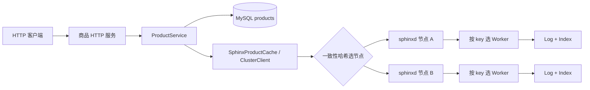

# 架构与调用链

## 项目边界

本项目有两个服务进程。`sphinx-product-service` 提供商品 HTTP 接口并连接 MySQL；`sphinxd` 是可部署多个实例的内存缓存节点。MySQL 保存商品的权威数据，缓存丢失、过期或淘汰后可以从 MySQL 重建。缓存节点不直接连接 MySQL，商品服务也不共享缓存节点的存储内存。

这是**静态分片缓存**：商品服务根据相同的节点列表和哈希环选目标节点；节点之间不复制数据，也不协商成员变更。节点内部再用 `hash(key) % worker_count` 找到拥有该 key 的 Worker。改变节点列表或 Worker 数量会改变部分 key 的位置；旧缓存不会自动迁移，之后的查询可通过 MySQL 重新回填。

## 商品请求

| 请求 | 业务顺序 | 对外结果 |
| --- | --- | --- |
| `GET /products/{id}` | 查 Sphinx；命中且商品合法则返回。未命中、缓存损坏或缓存故障时查 MySQL，随后尽力按 TTL 回填。 | `X-Cache` 显示 `HIT`、`MISS`、`CORRUPT` 或 `BYPASS`。MySQL 明确无记录才返回 404。 |
| `GET /products/{id}?fresh=1` | 跳过缓存，直接读 MySQL。 | 用于核对权威值；`X-Cache: BYPASS`。 |
| `PUT /products/{id}` | MySQL 事务内锁定记录，检查 `expected_version`，执行带版本条件的更新并确认提交；成功后尽力删除缓存。 | 成功返回新版本；版本不匹配返回 409。缓存删除失败不撤销已提交的更新，并通过响应头提示。 |

对应代码：[HTTP 路由](../product-service/src/product_http_routes.cpp)负责解析与响应；[ProductService](../product-service/src/product_service.cpp)负责缓存旁路策略；[MySQL 存储](../product-service/src/mysql_product_store.cpp)负责事务和错误分类；[缓存适配器](../product-service/src/sphinx_product_cache.cpp)调用集群客户端。商品的缓存 key 是 `product:v2:{id}`，值是含 `id`、`name`、`price_cents`、`version` 的 JSON；解码后还会校验字段和请求 ID。

### 一次未命中如何进入缓存节点

1. HTTP Worker 第一次处理请求时创建自己的 `MySqlProductStore`、`SphinxProductCache` 和 `ProductService`；MySQL 与缓存连接不跨 HTTP 工作线程共享。[对象构造](../product-service/src/product_http.cpp)按 MySQL 线程环境、存储、缓存、业务服务的生命周期顺序安排。
2. `ClusterClient` 用 key 在一致性哈希环上选择一个 Sphinx 节点，复用到该节点的 TCP 连接，发送 Memcached 文本协议 `get`。[节点路由](../sphinxd/src/cluster.cpp)和[客户端传输](../sphinxd/src/cluster_client.cpp)相互分开。
3. 节点的接入 Worker 通过 `epoll` 收取字节，[Server](../sphinxd/src/server/server.cpp)保留未完整的 TCP 帧，解析命令，并按 key 找到拥有存储分片的 Worker。若目标不是接入 Worker，请求通过有界跨线程通道传递；响应回到原 Worker 后按请求顺序写回。[Connection](../sphinxd/src/server/connection.cpp)管理回包顺序。
4. 目标 Worker 在自己的 [Log 和 Index](../sphinxd/src/logmem.cpp) 中查找未过期的值。未找到时返回 `END`；商品服务再读 MySQL，并尽力发 `set` 回填。每个 Worker 独占自己的存储分片，因此普通存储操作不需要跨 Worker 共用一把锁。

`sphinxd` 还接受独立客户端的 `set/get/delete/stats/version`；`get` 支持多个 key，并由接入 Worker 聚合子结果。这些能力用于展示缓存节点本身的协议、跨线程路由和观察指标；商品 HTTP 接口当前只使用单键 `get/set/delete`。

## 一致性与故障边界

- MySQL 的版本条件更新防止两个更新者无声覆盖彼此。**提交结果未知**与明确失败分开处理：调用方不能据此盲目重试或假定缓存已失效。
- 缓存写入和删除都是尽力而为。缓存故障时 GET 可回源；更新提交后若删除失败，普通 GET 仍可能读到旧值，直到 TTL 到期。
- 一个较早开始的 GET 也可能在更新完成后回填旧值。当前实现没有分布式锁或版本栅栏，因此只承诺最终由 TTL 收敛；`fresh=1` 可读取 MySQL 权威值。
- 缓存节点无副本和自动故障转移；一致性哈希负责选节点，不负责高可用或在线迁移。

## 建议阅读顺序

1. [README 的商品演示](../README.md#跑通一个商品)：先看到 MySQL、HTTP 与两个缓存节点怎样协作。
2. [ProductService](../product-service/src/product_service.cpp)与[MySQL 存储](../product-service/src/mysql_product_store.cpp)：理解读回填、版本更新与提交后失效。
3. [ClusterClient](../sphinxd/src/cluster_client.cpp)与[Server](../sphinxd/src/server/server.cpp)：理解选节点和节点内按 key 选 Worker。
4. [ReactorGroup](../sphinxd/src/reactor.cpp)、[Connection](../sphinxd/src/server/connection.cpp)与 [Log](../sphinxd/src/logmem.cpp)：再看跨线程、回包保序和分片存储。

## 验证范围

普通构建与 `ctest` 覆盖缓存协议、网络、集群路由和商品业务单元测试。MySQL 与 HTTP 集成测试需要独立测试数据库；未提供凭据时会跳过。要确认真实数据库链路，按 [README 的严格验收步骤](../README.md#严格集成验收)运行脚本。
