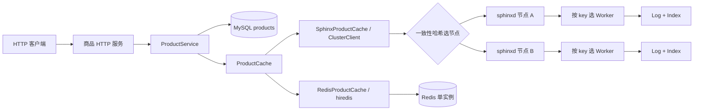

# 架构与调用链

## 项目边界

`sphinx-product-service` 提供商品 HTTP 接口并连接 MySQL；缓存默认走项目自带的 `sphinxd`，也可切换到外部 Redis。MySQL 保存商品的权威数据，缓存丢失、过期或淘汰后可以从 MySQL 重建。商品服务不共享缓存客户端或缓存进程的存储内存。

Sphinx 路径是**静态分片缓存**：商品服务根据相同的节点列表和哈希环选目标节点；节点之间不复制数据，也不协商成员变更。节点内部再用 `hash(key) % worker_count` 找到拥有该 key 的 Worker。改变节点列表或 Worker 数量会改变部分 key 的位置；旧缓存不会自动迁移，之后的查询可通过 MySQL 重新回填。Redis 路径当前连接一个 Redis 实例，不配置 Redis Cluster、复制或故障转移。

## 商品请求

| 请求 | 业务顺序 | 对外结果 |
| --- | --- | --- |
| `GET /products/{id}` | 查配置选择的缓存；命中且商品合法则返回。未命中、缓存损坏或缓存故障时查 MySQL，随后尽力按 TTL 回填。 | `X-Cache` 显示 `HIT`、`MISS`、`CORRUPT` 或 `BYPASS`。MySQL 明确无记录才返回 404。 |
| `GET /products?ids=...` | 去重后批量查缓存、合并一次 MySQL 回源，再按请求顺序恢复结果；Redis 用原生 MGET，Sphinx 按节点分组 multi-get。 | 逐项返回商品或业务错误，保留重复 ID 和输入顺序。 |
| `GET /products/{id}?fresh=1` | 跳过缓存，直接读 MySQL。 | 用于核对权威值；`X-Cache: BYPASS`。 |
| `PUT /products/{id}` | MySQL 事务内锁定记录，检查 `expected_version`，执行带版本条件的更新并确认提交；成功后尽力删除缓存。 | 成功返回新版本；版本不匹配返回 409。缓存删除失败不撤销已提交的更新，并通过响应头提示。 |

对应代码：[HTTP 路由](../product-service/src/product_http_routes.cpp)负责解析与响应；[ProductService](../product-service/src/product_service.cpp)负责缓存旁路策略；[MySQL 存储](../product-service/src/mysql_product_store.cpp)负责事务和错误分类；[工厂](../product-service/src/product_cache_options.cpp)选择 [Sphinx 适配器](../product-service/src/sphinx_product_cache.cpp)或 [Redis 适配器](../product-service/src/redis_product_cache.cpp)。商品缓存 key 是 `product:v3:{id}`，值严格校验字段、JSON 类型和请求 ID。basic 不使用负缓存；protected 才以短 TTL 缓存真实 NotFound。

### 一次未命中如何进入缓存节点

1. HTTP Worker 第一次处理请求时创建自己的 `MySqlProductStore`、所选 `ProductCache` 和 `ProductService`；MySQL 与缓存连接不跨 HTTP 工作线程共享。[对象构造](../product-service/src/product_http.cpp)按 MySQL 线程环境、存储、缓存、业务服务的生命周期顺序安排。
2. Sphinx 适配器由 `ClusterClient` 用 key 在一致性哈希环上选节点并发送 Memcached 文本协议；Redis 适配器由 hiredis 发送 RESP 命令，包括 `GET`、`SET ... EX`、`DEL`、`MGET` 和 pipeline `SET`。
3. Sphinx 节点的接入 Worker 通过 `epoll` 收取字节，[Server](../sphinxd/src/server/server.cpp)保留未完整的 TCP 帧，解析命令，并按 key 找到拥有存储分片的 Worker。若目标不是接入 Worker，请求通过有界跨线程通道传递；响应回到原 Worker 后按请求顺序写回。[Connection](../sphinxd/src/server/connection.cpp)管理回包顺序。
4. Sphinx 目标 Worker 在自己的 [Log 和 Index](../sphinxd/src/logmem.cpp) 中查找未过期的值；Redis 则由服务端执行对应命令。cache miss 后商品服务查 MySQL，并尽力回填。Redis 的多个 pipeline 命令减少往返，但不是事务。

`sphinxd` 还接受独立客户端的 `set/get/delete/stats/version`；`get` 支持多个 key，并由接入 Worker 聚合子结果。HTTP 商品服务另提供 `/metrics`，返回进程内计数、延迟桶、读协调器和熔断器快照；metrics 不初始化 Worker 或访问 MySQL/缓存。

## 一致性与故障边界

- MySQL 的版本条件更新防止两个更新者无声覆盖彼此。**提交结果未知**与明确失败分开处理：调用方不能据此盲目重试或假定缓存已失效。
- 缓存写入和删除都是尽力而为。缓存故障时 GET 可回源；更新提交后若删除失败，普通 GET 仍可能读到旧值，直到 TTL 到期。
- 一个较早开始的 GET 也可能在更新完成后回填旧值。当前实现没有分布式锁或版本栅栏，因此只承诺最终由 TTL 收敛；`fresh=1` 可读取 MySQL 权威值。
- 缓存节点无副本和自动故障转移；一致性哈希负责选节点，不负责高可用或在线迁移。
- protected 的回源合并和读并发准入只在单个商品服务进程内生效；多个进程各自维护状态。缓存熔断也不参与 PUT 的提交后删除。

## 建议阅读顺序

1. [README 的商品演示](../README.md#跑通一个商品)：先看到 MySQL、HTTP 与两个缓存节点怎样协作。
2. [ProductService](../product-service/src/product_service.cpp)与[MySQL 存储](../product-service/src/mysql_product_store.cpp)：理解读回填、版本更新与提交后失效。
3. [ClusterClient](../sphinxd/src/cluster_client.cpp)与[Server](../sphinxd/src/server/server.cpp)：理解选节点和节点内按 key 选 Worker。
4. [ReactorGroup](../sphinxd/src/reactor.cpp)、[Connection](../sphinxd/src/server/connection.cpp)与 [Log](../sphinxd/src/logmem.cpp)：再看跨线程、回包保序和分片存储。
5. [Redis 学习路线](REDIS_LEARNING_ROUTE.md)：沿 ProductCache 接口、Redis RESP、批量操作、保护策略和指标继续阅读。

## 验证范围

普通构建与 `ctest` 覆盖缓存协议、网络、集群路由和商品业务单元测试。MySQL 与 HTTP 集成测试需要独立测试数据库；未提供凭据时会跳过。要确认真实数据库链路，按 [README 的严格验收步骤](../README.md#严格集成验收)运行脚本。
