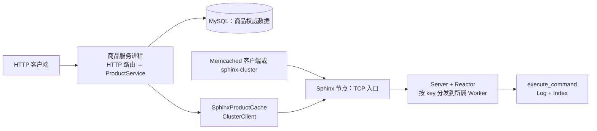

# Sphinx：先看懂它怎样运转

**一句话：**Sphinx 是 Linux 上的内存 KV 缓存，接受 Memcached 文本命令。它用多个工作线程分管不同的 key，并用内存段和哈希索引保存数据。仓库还提供一个**可选、独立运行**的商品 HTTP 服务：MySQL 保存商品原始数据，Sphinx 只缓存查询结果；MySQL 并未嵌入缓存节点。

## 两个进程、五块职责

| 部分 | 负责什么 | 为什么这样分 |
| --- | --- | --- |
| 网络与线程：`EpollReactor`、`TcpSocket`、`ReactorGroup` | `epoll` 收发；每个 Worker 有自己的事件循环，跨 Worker 用有界消息通道和 `eventfd` 唤醒 | 慢连接与跨线程通信不直接碰别人的存储 |
| 协议与调度：`Parser`、`Server`、`Connection` | 拆 Memcached 命令、按 `hash(key) % worker数` 找负责人、聚合多键查询、按请求序号回包 | TCP 可以拆包，跨线程响应也可能乱序 |
| 存储：`Log`、`Segment`、`Index` | 在预分配的内存段中追加对象；索引指向每个 key 的当前对象；过期和旧段回收会让缓存项消失 | 每个 Worker 独占一份存储，不用给每次读写加共享锁 |
| 集群客户端：`ConsistentHashRing`、`ClusterClient` | 在**客户端**选 Sphinx 节点，复用 TCP 连接并执行 `get/set/delete` | 多节点路由不要求节点彼此通信；这里没有复制或自动故障转移 |
| 可选商品服务：`ProductService`、`ProductStore`、`ProductCache` | HTTP 校验与 JSON、MySQL 事务更新、Sphinx 读缓存和提交后失效 | 业务规则只依赖存储/缓存接口；MySQL 是权威数据源，缓存故障可回源 |

## 从哪里启动

- **缓存节点**：[`sphinxd.cpp`](../sphinxd/src/sphinxd.cpp) 的 `main()` 解析配置，创建共享 `ServerStats` 和 `ReactorGroup`，再启动 N 个线程。每个 `run_server_thread()` 先用 `Memory::mmap()` 分到自己的内存，构造 `Server`（内含 `Log` 与 `Reactor`），通过 `Server::serve()` 建立带 `SO_REUSEPORT` 的监听 socket，进入 `EpollReactor::run()`。
- **商品服务（需启用 `BUILD_MYSQL_SPHINX_DEMO`）**：[`product_main.cpp`](../examples/mysql_sphinx/src/product_main.cpp) 读取环境配置，构造 `ProductHttpServer`；它先初始化 MySQL 客户端运行时，再启动固定的 HTTP 工作线程。每个线程第一次处理请求时创建自己的 `WorkerContext`：`MySqlThreadGuard → MySqlProductStore → SphinxProductCache → ProductService`。MySQL 连接在首次实际查询时才建立。
- [`sphinx-cluster.cpp`](../sphinxd/src/sphinx-cluster.cpp) 是命令行客户端入口，不是服务端。它创建 `ClusterClient`，用一致性哈希选择节点。

## 最核心的调用链

**缓存 `get key`：**`TcpSocket::on_pollin()` → `Server::recv()` 保留未完整的 TCP 字节 → `Server::process_one()` 调 `Parser::parse()` → `Server::dispatch_command()` 按 key 选 Worker → 目标 Worker 的 `Server::handle_command()` → `execute_command()` → `Log::find_value()` / `Index::find()` → `Server::send_response()` → 连接所属 Worker 的 `Connection::enqueue_response()` → `TcpSocket::send()` 返回 `VALUE ...` 或 `END`。如果目标就是当前 Worker，中间的跨线程 `Command/Response` 消息可以省去。

**商品查询：**HTTP 路由 `install_product_routes()` → `ProductService::get()` → `SphinxProductCache::get()` / `ClusterClient::get()` → 缓存未命中时 `MySqlProductStore::find()` → `ProductService` 尽力回填缓存 → HTTP 路由返回 JSON。商品修改则走 `ProductService::update()` → MySQL 带版本条件的事务更新并确认提交 → 尽力删除 Sphinx 缓存。

## 对象归谁、线程怎样协作

`run_server_thread()` 的 `Memory` 拥有 `mmap` 区域，`Server::Log` 只借用它；变量析构顺序保证先销毁 `Server` 再解除内存映射。一个 Worker 独占它的 `Server`、`Log`、连接表和 socket 事件循环。`EpollReactor` 用 `shared_ptr<Pollable>` 管理 socket 生命周期；`Connection` 保存 socket 的 `weak_ptr`。跨 Worker 的 `Command` / `Response` 自带字符串数据，用 `shared_ptr<Message>` 放入 `ReactorGroup` 的队列；共享的 `ServerStats` 用原子计数。只有通道、唤醒和统计等跨线程状态需要同步。

商品服务的 `ProductService` 借用同一 HTTP 工作线程的 `ProductStore` 与 `ProductCache`；`WorkerContext` 按上述顺序构造、逆序析构。每个线程有自己的 MySQL 连接和 `ClusterClient`，不会把连接交给别的线程。缓存请求使用同步客户端，但它运行在 HTTP 工作线程里，不会阻塞 `sphinxd` 的 Reactor。

## 推荐先看的 10 个文件

按顺序读，先建立缓存主链，再看可选业务层：

1. [`sphinxd/src/sphinxd.cpp`](../sphinxd/src/sphinxd.cpp)：线程和内存从哪来。
2. [`sphinxd/src/server/server.cpp`](../sphinxd/src/server/server.cpp)：请求在哪里拆包、路由、回包。
3. [`sphinxd/src/reactor-epoll.cpp`](../sphinxd/src/reactor-epoll.cpp)：事件循环怎样驱动 `Server`。
4. [`sphinxd/include/sphinx/protocol.h`](../sphinxd/include/sphinx/protocol.h)：看 `Parser` 的接口和 `parse()`；中间的大段状态机表可以跳过。
5. [`sphinxd/src/server/connection.cpp`](../sphinxd/src/server/connection.cpp)：多键聚合与流水线响应保序。
6. [`sphinxd/src/server/command_executor.cpp`](../sphinxd/src/server/command_executor.cpp)：命令如何落到存储操作。
7. [`sphinxd/src/logmem.cpp`](../sphinxd/src/logmem.cpp)：追加写、索引更新、过期和段淘汰。
8. [`sphinxd/src/cluster_client.cpp`](../sphinxd/src/cluster_client.cpp)：客户端如何路由并与缓存节点对话。
9. [`examples/mysql_sphinx/src/product_http.cpp`](../examples/mysql_sphinx/src/product_http.cpp)：可选服务的线程与对象生命周期。
10. [`examples/mysql_sphinx/src/product_service.cpp`](../examples/mysql_sphinx/src/product_service.cpp)：缓存优先读取、MySQL 更新和缓存失效规则。

## 串一次真实请求

假设数据库已有 `id=42` 的商品，客户端首次请求 `GET /products/42`。HTTP Worker 经路由调用 `ProductService::get(42)`，先向 Sphinx 发送 `get product:v1:42`。Sphinx 接入线程解析命令；如果 key 属于另一 Worker，就通过 `ReactorGroup` 发给该 Worker。它的 `Log::find_value()` 未找到，回 `END`；原接入线程按序把结果写回。`ClusterClient::get()` 将其解释为未命中，于是 `MySqlProductStore::find(42)` 从 MySQL 取出商品。`ProductService` 编码并尽力以 TTL 写回 Sphinx，最后 HTTP 返回商品 JSON，`X-Cache: MISS`。下次相同请求若缓存仍有效，直接在 Sphinx 命中，响应为 `X-Cache: HIT`，不再查询 MySQL。缓存可过期或提前淘汰，因此商品记录始终以 MySQL 为准。
