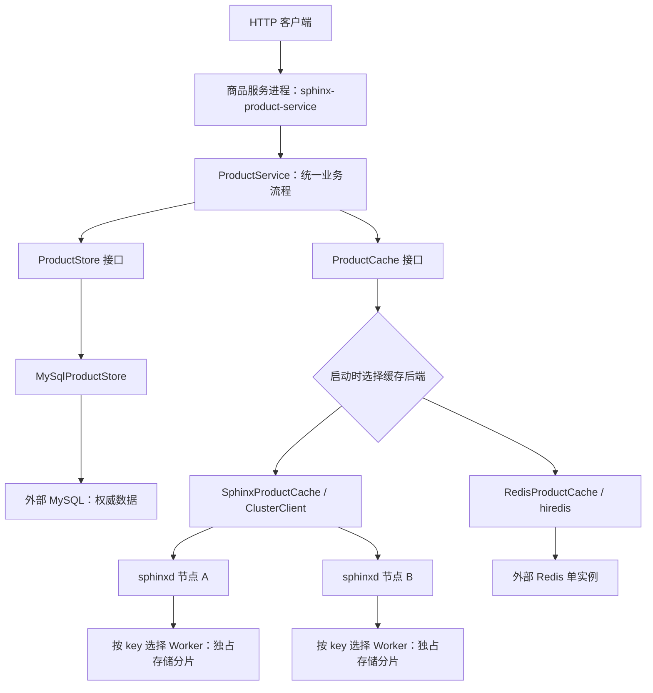

# 项目整体架构

## 1. 项目解决什么问题

这是一个 C++17 商品服务与缓存项目。MySQL 保存商品的权威数据，商品 HTTP 服务负责查询与版本更新，缓存保存有 TTL、可以丢弃和重建的查询结果。缓存默认使用自研 Sphinx，也可以切换到 Redis，两条路径共用业务规则、缓存格式和保护策略。

项目同时包含两部分：一部分展示 HTTP、数据库事务与 Cache-Aside（旁路缓存）的完整业务链路；另一部分实现 Sphinx 缓存节点本身的网络协议、线程路由与内存存储。MySQL 和 Redis 使用外部服务，Sphinx 的客户端与缓存节点由本仓库实现。

运行时选择的是 **MySQL + Sphinx** 或 **MySQL + Redis**。一个商品服务进程使用其中一种缓存后端，不同时向两个后端读写，也没有纯 MySQL 运行模式。

## 2. 进程与请求关系



图中的两条缓存分支表示可选部署。`SPHINX_CACHE_BACKEND=sphinx|redis` 决定实例采用哪一条，默认是 `sphinx`；`SPHINX_CACHE_POLICY=basic|protected` 独立决定是否启用读保护，默认是 `basic`。

| 组件 | 部署与职责 | 数据角色 |
| --- | --- | --- |
| `sphinx-product-service` | 独立 HTTP 进程，解析请求、编排读写、连接数据库和选定缓存 | 不持久化商品，持有连接、保护状态和指标 |
| MySQL | 外部数据库，执行预处理查询和事务更新 | 商品权威数据 |
| `sphinxd` | 一个或多个独立缓存节点，提供 Memcached 文本协议 | 可过期、可重建的内存缓存 |
| Redis | 可选的外部单实例缓存，与 Sphinx 做对照 | 同样是可过期、可重建的缓存 |

Sphinx 节点不连接 MySQL；商品服务通过网络访问缓存节点，不共享其存储内存。Redis 路径运行时不需要启动 Sphinx 节点，但默认构建仍包含两种适配器与节点程序。

## 3. 商品服务的代码分层

源文件位于 `product-service/src`，公开头文件位于 `product-service/include/sphinx/product`，测试位于 `product-service/test`。三者按对应职责组织；商品模型定义在公开头文件中，领域校验实现放在 `src/domain`。

```text
product-service/
  include/sphinx/product/        公开接口，按下列职责组织
  src/
    domain/                     商品字段与更新请求的约束校验
    application/                读写流程、业务结果、限制与指标
      ports/                    权威存储与缓存接口
      cache/                    统一缓存编码与 basic/protected 策略
      protection/               回源合并、数据库读准入和缓存熔断
    backends/
      mysql/                    MySQL 配置、客户端运行时、存储实现
      sphinx/                   Sphinx 配置与缓存适配器
      redis/                    Redis 配置与缓存适配器
    http/                       HTTP 监听、参数解析和响应映射
    bootstrap/                  环境配置、后端工厂、Worker 装配和入口
  test/                         按 application/backends/http/bootstrap 等组织
  schema/mysql/schema.sql       商品表结构
```

这些目录对应实际依赖边界：HTTP 调用业务层，业务层调用抽象接口，适配器实现接口，启动层把它们组合起来。业务层不包含 MySQL、hiredis 或 Sphinx 客户端头文件，三个后端互不依赖。HTTP 层不选择后端，也不创建数据库或缓存对象。

| 层 | 核心类型或入口 | 负责什么 |
| --- | --- | --- |
| domain | [Product、UpdateProductRequest](../product-service/include/sphinx/product/domain/product.h) | 定义商品与修改请求；校验 ID、版本、名称和整数价格 |
| application | [ProductService](../product-service/include/sphinx/product/application/product_service.h) | `get`、`get_many`、`update`；缓存旁路、错误分类与保护流程 |
| application/ports | [ProductStore](../product-service/include/sphinx/product/application/ports/product_store.h)、[ProductCache](../product-service/include/sphinx/product/application/ports/product_cache.h) | 规定权威存储和缓存的调用契约，隔离具体协议与客户端 |
| application/cache | [codec](../product-service/src/application/cache/product_codec.cpp)、[ProductCachePolicy](../product-service/include/sphinx/product/application/cache/product_cache_policy.h) | 统一 key、正负缓存格式、解码校验与 TTL 规则 |
| application/protection | [ProductSharedState](../product-service/include/sphinx/product/application/protection/product_shared_state.h) | 组织共享指标、读协调器与熔断器 |
| backends/mysql | [MySqlProductStore](../product-service/src/backends/mysql/mysql_product_store.cpp)、[MySqlRuntime](../product-service/src/backends/mysql/mysql_runtime.cpp) | 连接、预处理 SQL、事务、版本更新和客户端资源生命周期 |
| backends/sphinx | [SphinxProductCache](../product-service/src/backends/sphinx/sphinx_product_cache.cpp) | 把缓存接口转换为 ClusterClient 调用 |
| backends/redis | [RedisProductCache](../product-service/src/backends/redis/redis_product_cache.cpp) | 把缓存接口转换为 hiredis 命令并管理回复、连接与故障恢复 |
| http | [ProductHttpServer](../product-service/src/http/product_http.cpp)、[routes](../product-service/src/http/product_http_routes.cpp) | 监听和调度 HTTP，请求解析、状态码、响应头与指标输出 |
| bootstrap | [配置](../product-service/src/bootstrap/product_config.cpp)、[工厂](../product-service/src/bootstrap/product_cache_factory.cpp)、[Worker 装配](../product-service/src/bootstrap/product_worker.cpp) | 读取配置、选择实现、创建对象并交给 HTTP 层 |

`ProductStore` 提供 `find`、`find_many`、`update`，返回商品或明确的存储结果。`ProductCache` 提供 `get`、`get_many`、`put`、`put_many`、`erase`，读写统一编码后的字节值。商品业务由 ProductService 编排，HTTP 层只把业务结果转换为协议响应。

## 4. 对象、线程与生命周期

[启动入口](../product-service/src/bootstrap/product_main.cpp)先读取并校验配置，再依次创建进程级 `MySqlRuntime`、`ProductSharedState` 和 `ProductHttpServer`。HTTP 服务接收获取当前 Worker 业务服务的回调，以及共享状态引用。

```text
商品服务进程
  MySqlRuntime                   进程级客户端库环境
  ProductSharedState             所有 HTTP Worker 共享
    ├─ ProductMetrics            原子事件计数
    ├─ ProductReadCoordinator    活动回源表、等待和数据库读名额
    └─ CacheCircuitBreaker       缓存故障状态与探测许可
  ProductHttpServer              固定数量的 HTTP Worker
    Worker 0 的 WorkerContext
      ├─ MySqlThreadGuard
      ├─ MySqlProductStore       本线程连接与预处理语句
      ├─ ProductCache            本线程选定的缓存客户端
      └─ ProductService          借用以上对象与共享状态
    Worker 1..N                  各自具有相同的一组独占对象
```

每个 HTTP Worker 第一次处理商品请求时，启动层回调才创建自己的 WorkerContext。数据库与缓存连接进一步在实际访问时惰性建立，随后由所属线程复用。`GET /metrics` 只读取共享状态，不初始化 WorkerContext，也不访问数据库或缓存。

HTTP Worker 使用同步数据库和缓存 I/O，因此等待后端会占用该 Worker。Sphinx 节点中的 Reactor Worker 属于另一个进程，负责节点网络与存储，两类 Worker 的职责和数量独立。

关闭 HTTP 服务后，等待 Worker 退出。每个 Worker 先销毁业务服务、缓存和存储，再销毁 MySQL 线程环境；进程随后销毁共享状态与 MySQL 客户端运行时。这保证客户端资源不会在运行时已结束后继续使用。

## 5. 一次请求怎样流经各层

### 单项查询

`GET /products/{id}` 经 HTTP 路由解析，调用 `ProductService::get`。默认 basic 策略执行以下流程：

1. 为商品生成 `product:v3:<id>`，通过 ProductCache 读取缓存。
2. 解码并验证字段和请求 ID；合法命中直接返回，不查 MySQL。
3. 未命中或缓存故障时回源；损坏值先尽力删除，再回源。
4. ProductStore 查询 MySQL；有记录则尽力按 TTL 回填，明确无记录才返回不存在。
5. HTTP 根据业务结果输出状态码和 `X-Cache`，区分 HIT、MISS、CORRUPT、BYPASS。

缓存故障和回填失败不会推翻已经取得的数据库结果。数据库不可用则返回错误，不能把失败解释成不存在。

`fresh=1` 跳过缓存读取和回源合并，直接查询 MySQL，之后仍尽力回填；protected 下数据库读准入继续生效。

### 批量查询

`GET /products?ids=...` 最多接受 32 个输入项，重复 ID 也占名额。业务层内部去重后读取缓存，把需要回源的商品合并查询，最后恢复原始顺序与重复项。单项和批量共用业务读流程；每一项都保留自己的商品结果或错误，批量外层 HTTP 200 不表示所有项成功。

MySQL 使用预处理 `IN` 查询。Redis 通过 MGET 批量读取、pipeline 批量回填；Sphinx 按节点分组执行 multi-get，回填逐条 set。只有一个唯一商品时，业务层使用单项缓存和存储接口。

### 修改商品

`PUT /products/{id}` 接收新名称、价格和 `expected_version`，只修改已有商品：

```text
HTTP 参数解析
  → ProductService::update
  → MySqlProductStore::update
      START TRANSACTION
      SELECT ... WHERE id = ? FOR UPDATE
      检查商品存在与 expected_version
      UPDATE ... WHERE id = ? AND version = ?，版本加一
      确认 COMMIT 成功
  → 尽力删除商品缓存
  → HTTP 输出新版本或业务错误
```

行锁控制事务内的并发读改写，版本检查让基于旧版本的修改返回冲突。不存在返回 404，版本冲突返回 409；项目没有新增商品的 HTTP 接口。

只有确认数据库提交成功才删除缓存。删除失败不回滚已提交更新，通过 `X-Cache-Invalidation: failed` 提示。提交结果无法确认时返回 CommitUnknown，丢弃连接，不自动重试更新，也不据此删除缓存。

## 6. 两条缓存路径怎样共用业务

| 维度 | Sphinx 路径 | Redis 路径 |
| --- | --- | --- |
| 适配器 | SphinxProductCache | RedisProductCache |
| 客户端与协议 | 自研 ClusterClient、Memcached 文本协议 | hiredis、RESP |
| 路由 | 客户端一致性哈希选节点，节点内部再按 key 选 Worker | 一个 Redis 实例 |
| 连接归属 | 每个 HTTP Worker 独占客户端，按节点复用 TCP 连接 | 每个 HTTP Worker 独占一个惰性连接 |
| 批量 | 按节点分组 multi-get，回填逐条 set | MGET，pipeline SET ... EX |
| 内存管理 | 节点自己的 Log、Index、TTL 与 segment 回收 | 外部 Redis 的 TTL、maxmemory 与淘汰策略 |
| 业务规则 | 共用 ProductService、codec、MySQL 更新和读保护 | 同左 |

缓存值是含 `id`、`name`、`price_cents`、`version` 的 JSON；protected 还支持 `id` 与 `not_found` 构成的负缓存标记。正缓存默认 TTL 为 30 秒，两条路径采用同一格式和校验规则。

替换缓存改变的是适配器、协议和存储行为，不改变商品事务。Sphinx 的 segment 回收不等于 Redis LRU，批量写入往返次数也不同，因此对照实验需说明负载、内存预算与批量行为，不能把所有差异都归因于存储引擎。

## 7. 读保护和指标放在哪里

basic 是默认旁路缓存策略；protected 在同一业务层增加保护，适用于两个后端：

| 机制 | 默认行为 | 作用范围 |
| --- | --- | --- |
| 负缓存 | MySQL 明确无记录时缓存 5 秒 | 减少不存在商品的重复回源 |
| TTL 抖动 | 正缓存按 ID 确定性抖动，默认 27～33 秒 | 分散不同商品的到期时间 |
| 同 ID 回源合并 | 一个 Leader 发布结果，Follower 等待；最多 1024 个活动 ID | 单个商品服务进程 |
| 数据库读准入 | 最多 min(2, HTTP Worker 数) 个并发回源操作 | 单进程的读负载，不限制 PUT |
| 等待期限 | 同一批 Follower 共用默认 500 ms 截止时间 | 超时不取消 Leader |
| 缓存熔断 | 连续失败 3 次后打开 2000 ms，之后只允许一个探测 | 单进程；不阻止更新后的缓存删除 |

Leader 回源前再查一次缓存；数据库查询完成后先归还读名额，再尽力回填并发布结果。批量请求先完成本批 Leader，再等待 Follower，避免交叉等待。容量不足、准入拒绝或等待超时返回 ReadBusy，单项 HTTP 状态为 503。

`GET /metrics` 输出 backend/policy 标签、商品与缓存事件计数、读协调器活动数量和熔断快照。指标是并发观测值，不是事务一致快照；HTTP 延迟分位数由对照客户端采样计算。

## 8. Sphinx 节点的内部架构

Sphinx 路径还有两次独立路由：ClusterClient 根据 key 在一致性哈希环上选缓存节点；到达节点后，Server 根据 key 的哈希选择拥有存储分片的 Worker。前者分配不同进程，后者分配节点内的不同线程。

```text
ClusterClient
  → 按 key 选 sphinxd 节点，复用 TCP 连接
  → 接入 Worker：Reactor 收取字节，Server 解析命令
  → 按 key 查找目标 Worker
      ├─ 本 Worker：直接执行
      └─ 其他 Worker：通过有界跨线程通道传递
  → 目标 Worker：访问独占的 Log 与 Index，检查 TTL
  → 响应回到接入 Worker，由 Connection 按请求顺序写回
```

节点存储以 Worker 为所有权边界，普通读写不跨 Worker 共享存储分片。multi-get 可以涉及不同 Worker，接入 Worker 聚合子结果并返回。

| 源码目录 | 主要职责与入口 |
| --- | --- |
| `sphinxd/src/client` | [cluster](../sphinxd/src/client/cluster.cpp)负责节点路由；[cluster_client](../sphinxd/src/client/cluster_client.cpp)及传输实现负责协议请求和连接 |
| `sphinxd/src/server` | [Server](../sphinxd/src/server/server.cpp)负责解析与分派；[Connection](../sphinxd/src/server/connection.cpp)管理连接状态和回包顺序 |
| `sphinxd/src/reactor` | [Reactor](../sphinxd/src/reactor/reactor.cpp)与 epoll 实现负责事件循环和线程间调度 |
| `sphinxd/src/storage` | [Log](../sphinxd/src/storage/logmem.cpp)、Index 及内存管理负责缓存记录、查找、到期与回收 |
| `sphinxd/src/common` | 缓冲区与统计等共享实现 |

节点提供 `set/get/delete/stats/version`，使用静态节点列表。改变节点列表或 Worker 数量可能改变 key 的位置，旧缓存不会自动迁移，可在之后的查询中从 MySQL 重建。

## 9. 构建依赖与验证入口

目录边界也落实为独立构建目标，主要依赖如下，箭头表示“依赖”：

```text
sphinx-product-service → sphinx_product_bootstrap
  bootstrap → sphinx_product_http → sphinx_product_core
  bootstrap → sphinx_product_mysql → sphinx_product_core + mysqlclient
  bootstrap → sphinx_product_redis → sphinx_product_core + hiredis
  bootstrap → sphinx_product_sphinx → sphinx_product_core + sphinx_client

sphinx_product_core → JSON 编码支持 + pthread
sphinx_client → sphinx_hash + pthread
sphinxd → sphinx_core → sphinx_hash + pthread
```

业务核心不链接数据库或缓存客户端，HTTP 目标不链接后端。Sphinx 适配器只链接集群客户端，不链接节点存储和 Reactor。节点与客户端共享哈希实现，不因此共享缓存数据。

具体目标见 [商品服务 CMake](../product-service/CMakeLists.txt)和 [Sphinx CMake](../sphinxd/CMakeLists.txt)。构建、运行与配置示例见 [README](../README.md)。

验证分为业务与后端单元测试、HTTP 生命周期测试、节点网络与集群测试，以及真实 MySQL/HTTP 集成测试。普通 CTest 缺少数据库凭据时会跳过相关集成用例。完整链路应使用独立测试库：

- [verify_mysql_sphinx.sh](../scripts/verify_mysql_sphinx.sh)：MySQL 与默认 Sphinx 路径的严格验证入口。
- [verify_product_cache.sh](../scripts/verify_product_cache.sh)：MySQL 与 Sphinx/Redis × basic/protected 四种组合的严格验证入口。
- [compare_product_cache.py](../scripts/compare_product_cache.py)：在统一商品请求下比较缓存路径，并观察淘汰、拒写、故障和保护行为。

## 10. 一致性与部署边界

MySQL 的事务与版本条件更新保证商品修改的数据库语义，但数据库提交与缓存删除之间没有原子事务。删除失败可能保留旧值；较早开始的 GET 也可能在 PUT 完成后回填旧版本。旧值按实际回填时设置的 TTL 过期，因此不能承诺更新后所有普通 GET 立即读到新版本，也不能承诺提交后固定 30 秒一定新鲜。`fresh=1` 用于读取数据库权威值。

缓存操作失败时读请求尝试回源，数据库失败则明确报错。后端连接故障不自动重放当前操作，后续独立操作可以重新连接。pipeline 也不提供批量写入的事务原子性。

当前没有缓存副本、自动故障转移或在线数据迁移；Redis 未接入 Sentinel 或 Cluster。读保护只在单个商品服务进程内协调，不是分布式锁或跨进程限流。Sphinx 是静态分片缓存，不能把一致性哈希本身视为高可用机制。

本文说明整体关系。Sphinx 节点与默认路径的细节见 [Sphinx 架构与调用链](ARCHITECTURE.md)，Redis 路径的命令契约与故障处理见 [Redis 对照架构](REDIS_ARCHITECTURE.md)。
